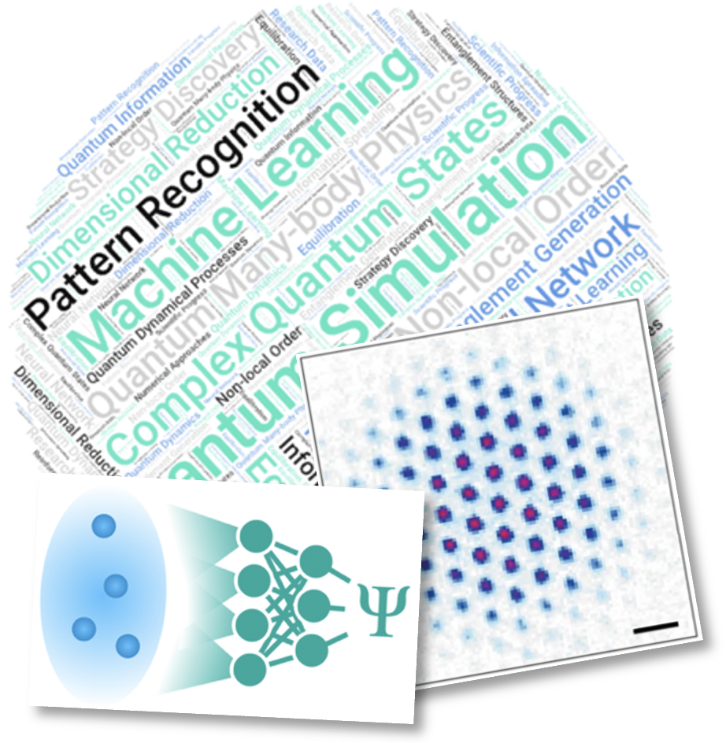

Our recently established collaborative research initiative “Machine Learning for Complex Quantum States” (MLCQS) – a consortium spanning nine different institutions across Germany and Switzerland – is seeking to fill several PhD positions.

<!--more-->

MLCQS will develop and employ tools of machine learning to investigate composite quantum systems with a focus on artificial quantum systems. Advanced capabilities of modern experimental techniques to manipulate and probe many-body quantum systems have made quantum simulation and quantum computing with substantial numbers of qubits a reality. But at the same time, fully leveraging their potential poses new challenges related to high-dimensional state representations and data as well as optimal control strategies. MLCQS will tackle these challenges by developing machine-learning-enhanced techniques for simulation, data analysis, and control. Our goals range from gaining theoretical insight to advancing experiments with ultracold atoms. Thereby, we will enable new insights into complex quantum states and dynamics.

We are looking for highly motivated candidates with a background in quantum many-body physics, quantum optics, or quantum information to work on the following projects:
* [Combining neural quantum states and quantum simulation: hybrid algorithms](/projects/project_01) [theory] 
Advisors: [Annabelle Bohrdt](/team/bohrdt) (LMU Munich), [Markus Schmitt](/team/schmitt) (Regensburg University)
* [Information dynamics of strongly interacting Bosons](/projects/project_02) [theory/experiment] 
Advisors: [Giuseppe Carleo](/team/carleo) (EPFL), [Christof Weitenberg](/team/weitenberg) (TU Dortmund)
* [Machine learning for qutrit-based quantum computing and simulation with Rydberg atoms](/projects/project_03) [experiment/theory] 
Advisors: [Monika Aidelsburger](/team/aidelsburger) (MPQ, Garching), [Annabelle Bohrdt](/team/bohrdt) (LMU Munich)
* [Learning feedback control of monitored quantum dynamics](/projects/project_04) [theory] 
Advisors: [Marin Bukov](/team/bukov) (MPI PKS, Dresden), [Markus Schmitt](/team/schmitt) (Regensburg University)
* [Optimal readout of quantum simulators](/projects/project_05) [experiment] 
Advisors: [Monika Aidelsburger](/team/aidelsburger) (MPQ, Garching), [Christof Weitenberg](/team/weitenberg) (TU Dortmund)
* [Wave function networks for correlated quantum matter](/projects/project_06) [theory] 
Advisor: [Markus Heyl](/team/heyl) (Augsburg University)

To make one of these your PhD project, send your CV and a motivation letter to the e-mail address stated below. **Applications will be reviewed starting Feb 27, 2026**.
