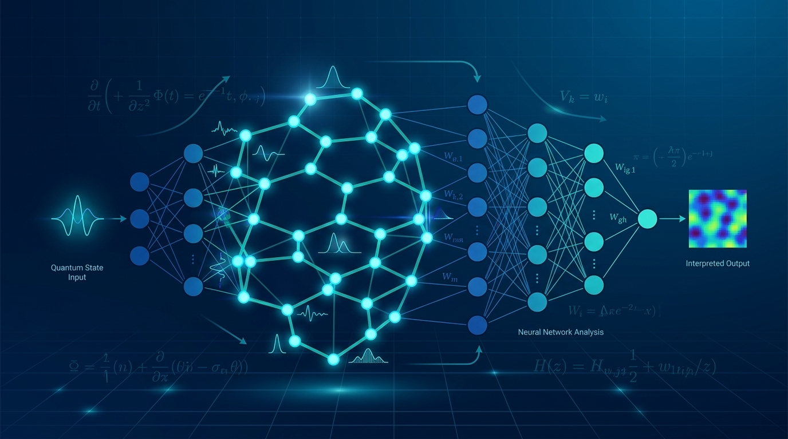
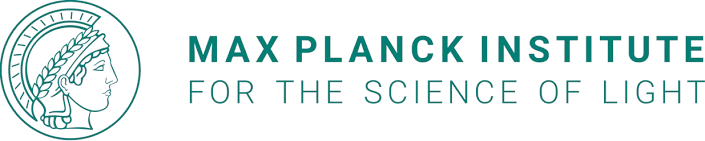
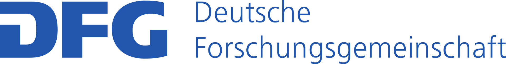

# Machine Learning for Complex Quantum Systems

**School for PhD and Master Students: 29 November – 4 December 2026**

**Venue:** [Max Planck Institute for the Science of Light, Erlangen](https://mpl.mpg.de/about-us/unique-to-mpl)

## Application Details
*   **Deadline:** September 30, 2026
*   **Registration Fee:** Free, but approval is required.
*   **Website & Application:** [https://indico.mlcqs.de/event/1/](https://indico.mlcqs.de/event/1/)
*   **Contact:** For inquiries, contact Ms. Julia Stier at julia.stier@verwaltung.uni-regensburg.de

## Accommodation

Participants are expected to book their own travel and accommodation. **Do NOT book your travel and accommodation before your application has been approved!** 

The following list of hotels may serve as a guideline:
- [Stadthaus Erlangen](https://www.stadthaus-erlangen.de/)
- [Hotel Luise](https://hotel-luise.de/)
- [Hotel Bayerischer Hof](https://www.bayerischer-hof-erlangen.de/)
- [The niu](https://the.niu.de/hotels/deutschland/erlangen/holiday-inn---the-niu-cure-erlangen)

## About the School & Tracks

Are you fascinated by the intersection of artificial intelligence and quantum physics? This specialized school invites PhD and Master students to explore cutting-edge machine learning techniques applied to complex quantum systems. Organized as part of the Research Unit FOR 5919, the program combines theoretical lectures with comprehensive hands-on coding tutorials to bridge foundational concepts with active research.

Participants choose one of two specialized tracks during Days 2–4:
*   **Track 1 (Neural Quantum States):** Focuses on representing complex many-body wave functions using neural network architectures, variational Monte Carlo, and ground state searches. No prior NQS knowledge is required!
*   **Track 2 (Reinforcement Learning for Quantum Tech):** Covers RL fundamentals, strategies for quantum control optimization, quantum error correction protocols, and quantum circuit dynamics. No prior RL knowledge is required!

## Program Schedule & Logistics
*   **Phase 1 (Nov 30, 1:30 PM Kick-off):** Introduction to deep learning, neural network architectures, and optimization.
*   **Phase 2 (Dec 1–3):** Intensive track-specific lectures and interactive track-oriented hands-on programming tutorials.
*   **Phase 3 (Dec 4, Ends 12:30 PM):** Joint scientific session featuring contemporary research talks.

**Prerequisites:** A basic understanding of quantum mechanics and Python proficiency are expected; no prior machine learning experience is needed.

**Equipment Required:** Participants must bring their own laptops for the hands-on numerical and coding sessions.

## Lecturers

**NQS Track**
- Annabelle Bohrdt (LMU Munich)
- Markus Heyl (Univ. of Augsburg)

**RL Track**
- Florian Marquardt (MPL Erlangen)
- Marin Bukov (MPI-PKS Dresden)

---
*Organized as part of Research Unit FOR 5919*

 
 
&nbsp;&nbsp;&nbsp;&nbsp;

